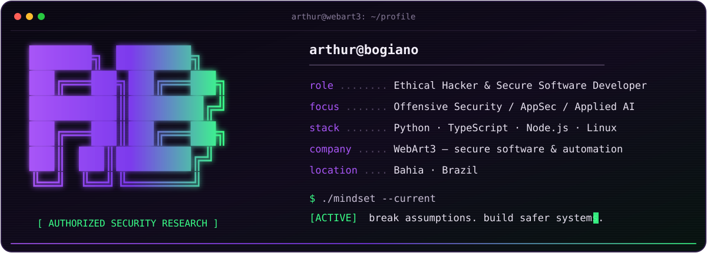

  

  

  
  
  

## `> whoami`

I build systems, break assumptions, and turn offensive findings into safer software.

I'm a security-focused software developer working at the intersection of **offensive security**, **secure product engineering**, and **applied artificial intelligence**. I approach technology from both sides: understanding how systems fail and applying that knowledge to build stronger applications, APIs, infrastructure, and automation.

<table>
  <tr>
    <td width="33%" valign="top">
      <h3>⚔️ Offensive Security</h3>
      
Authorized web, API, network, and wireless assessments; attack-surface analysis; exploit validation; security automation; and remediation guidance.

    </td>
    <td width="33%" valign="top">
      <h3>🛡️ Secure Engineering</h3>
      
Web platforms, backend APIs, dashboards, integrations, and infrastructure designed with security as an architectural requirement.

    </td>
    <td width="33%" valign="top">
      <h3>🧠 Applied AI</h3>
      
AI agents, LLM integrations, intelligent workflows, WhatsApp automation, and tools that turn operations into scalable systems.

    </td>
  </tr>
</table>

## `> selected_operations`

  
  

  

- **RoguESP32** — ESP32 rogue access point and captive portal lab for authorized wireless security research and awareness training.
- **Bisq Advanced Monitor** — Headless Bisq offer monitoring with a terminal dashboard, Telegram alerts, systemd services, and secret-safe configuration.
- **WhatsApp Media Decrypt** — Python microservice using HKDF, AES-CBC, and HMAC verification to process WhatsApp media.

> Most commercial systems and AI products are maintained in private repositories due to client confidentiality and operational security.

## `> arsenal --list`

### Security

  
  
  
  
  
  

### Development, infrastructure & AI

  

  
  
  
  
  

## `> activity --public`

  
<strong>GitHub metrics</strong>

   

  

    
    
  

  

    
  

## `> current_mission`

- Building secure, AI-powered products and business automation.
- Improving real-world application security through an attacker's perspective.
- Developing offensive tooling that produces practical defensive value.
- Running **[WebArt3](https://webart3.com)** — secure web systems, automation, AI solutions, and security-focused digital products.

## `> contact`

  
  

## `> rules_of_engagement`

> [!IMPORTANT]
> All offensive-security material published here is intended exclusively for **authorized testing, controlled laboratories, education, and defensive research**. I do not support or endorse unauthorized access to systems, networks, accounts, or data.

<!--
Visual references:
- Anurag Hazra: custom profile header and repository cards
- DenverCoder1: typing SVG and modular profile sections
- Andrew6rant: neofetch-inspired terminal identity
The terminal banner in this repository is an original asset created for Arthur Bogiano.
-->
